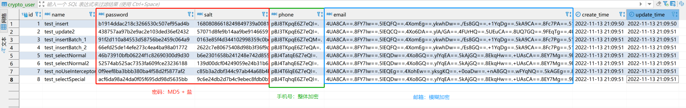

<h1 align="center">
    <a href="https://github.com/EastX/java-practice-demos/tree/main/demo-cache">
        数据加密实践示例
    </a>
</h1>

<p align="center">
    <a href="https://www.oracle.com/java/technologies/downloads/archive/">
        
    </a>
    <a href="https://docs.spring.io/spring-boot/docs/2.7.2/reference/html/">
        
    </a>
    <a href="https://dev.mysql.com/downloads/mysql/">
        
    </a>
    <a href="https://baomidou.com/">
        
    </a>
    <a href="https://github.com/JSQLParser/JSqlParser/wiki">
        
    </a>
</p>

## 1. 数据加密概述
> 加密：将明文信息改变为难以读取的密文内容。
> <br> 解密：将密文内容转化为原来数据。

**分类**
- 对称加密：加密与解密密钥相同。
- 非对称加密：加密使用公钥，公钥可公开；解密使用私钥。

**相关阅读：**
- [加密 - wikipedia](https://zh.wikipedia.org/wiki/%E5%8A%A0%E5%AF%86)

## 2. 加密工具
> 使用工具类封装具体处理，方便变更。

- [x] **密钥相关** [`CryptoKeyUtil.java`](./src/main/java/cn/eastx/practice/demo/crypto/util/CryptoKeyUtil.java)
    - 使用本地文件对对称密钥进行存储（resources/crypto/symmetric_key.keystore）
    - 使用建议重新执行 `generateCryptoKey()` 生成密钥
- [x] **数据加密相关** [`CryptoDataUtil.java`](./src/main/java/cn/eastx/practice/demo/crypto/util/CryptoDataUtil.java)
    - 封装使用 RC4 作为对称加密算法进行加密解密（加密后长度相对较短）
    - 支持处理数据库字段 整体加密、模糊加密 处理
    - 加密数据处理 相关工具类 测试 [`CryptoDataUtilTest.java`](./src/test/java/cn/eastx/practice/demo/crypto/util/CryptoDataUtilTest.java)
        - 整体加密数据库字段长度与保存值长度对应（需要额外存储一个标识符）
        
        | 数据库字段长度     | 字符长度     |
        |---|---|
        | varchar(49) | 12个中文字符、36个ascii字符 |
        | varchar(97)  | 24个中文字符、72个ascii字符、3个ascii字符+23个中文字符、68个ascii字符+1个中文字符 |
        | varchar(197)  | 49个中文字符、145个ascii字符、3个ascii字符+48个中文字符 、 142个ascii字符+1个中文字符 |
        | varchar(253)  | 63个中文字符、189个ascii字符 、3个ascii字符+62个中文字符 、 186个ascii字符+1个中文字符 |

        - 模糊加密数据库字段产犊与保存值长度对应（4个字节加密一次大致对应8个字符+1个标识符），根据4位英文字符（半角），2个中文字符（全角）为一个检索条件

        | 数据库字段长度      | 字符长度     |
        |---|---|
        | varchar(99)   | 12个中文字符、14个ascii字符 |
        | varchar(198) | 23个中文字符、25个ascii字符 |
        | varchar(252) | 29个中文字符、31个ascii字符 |


## 3. 数据库隐私字段加密注解组件
> **说明**
> 1. 数据库存储密文字段，内存可见为明文信息
> 2. 可设定字段保存值支持 整体加密（仅可全部匹配查询）、模糊加密（支持模糊查询）
> 3. 相关做法： [数据库隐私字段加密以及加密后的数据如何进行模糊查询？ - 业余草](https://mp.weixin.qq.com/s/xUeVAROQHHGHEOZoZ5m02A)

### 3.1 MyBatis-Plus 实现（做法：使用 常规2 处理）

#### 1 ：利用 TypeHandler 支持数据加解密转换
> INSERT VALUE、UPDATE ENTITY、SELECT RESULT
> <br> 只对数据库和程序之间的数据转换，查询条件不会调用。

- 整体加密 [`OverallCryptoTypeHandler.java`](./src/main/java/cn/eastx/practice/demo/crypto/config/mp/OverallCryptoTypeHandler.java)
    ```
    使用示例：
    1. MyBatis-Plus 注解（自动生产 ResultMap ，存在场景不生效）
        @TableField(typeHandler = OverallCryptoTypeHandler.class)
    2. 自定义 ResultMap 配置
        <result column="phone" property="phone" typeHandler="cn.eastx.practice.demo.crypto.config.mp.OverallCryptoTypeHandler" />
    ```
    ```java
    @Override
    public void setNonNullParameter(PreparedStatement ps, int i, String parameter, JdbcType jdbcType) throws SQLException {
        /*
            对非null参数值进行加密，需要通过实体类处理方可，支持 INSERT/UPDATE ENTITY
            当前处理 INSERT ENTITY，UPDATE ENTITY 会先通过拦截器处理
            因为拦截器修改元数据将导致实体类属性值产生变更，所以实体类还是由 TypeHandler 来进行处理
         */
        ps.setString(i, CryptoDataUtil.overallEncrypt(parameter));
    }

    @Override
    public String getNullableResult(ResultSet rs, String columnName) throws SQLException {
        // 对可为null的结果进行解密
        return CryptoDataUtil.decrypt(rs.getString(columnName));
    }
    ```
- 模糊加密 [`FuzzyCryptoTypeHandler.java`](./src/main/java/cn/eastx/practice/demo/crypto/config/mp/FuzzyCryptoTypeHandler.java)
    - 注：根据4位英文字符（半角），2个中文字符（全角）为一个检索条件，如果字段值较少查询可能存在问题
    ```
    使用示例：
    1. MyBatis-Plus 注解（自动生产 ResultMap ，存在场景不生效）
        @TableField(typeHandler = FuzzyCryptoTypeHandler.class)
    2. 自定义 ResultMap 配置
        <result column="phone" property="phone" typeHandler="cn.eastx.practice.demo.crypto.config.mp.FuzzyCryptoTypeHandler" />
    ```
    ```java
    @Override
    public void setNonNullParameter(PreparedStatement ps, int i, String parameter, JdbcType jdbcType) throws SQLException {
        /*
            对非null参数值进行加密，需要通过实体类处理方可，支持 INSERT/UPDATE ENTITY
            当前处理 INSERT ENTITY，UPDATE ENTITY 会先通过拦截器处理
            因为拦截器修改元数据将导致实体类属性值产生变更，所以实体类还是由 TypeHandler 来进行处理
         */
        ps.setString(i, CryptoDataUtil.fuzzyEncrypt(parameter));
    }

    @Override
    public String getNullableResult(ResultSet rs, String columnName) throws SQLException {
        // 对可为null的结果进行解密
        return CryptoDataUtil.decrypt(rs.getString(columnName));
    }
    ```

#### 2 ：利用字段注解配合 MyBatis 拦截器对条件进行拦截处理
> 注：目前仅支持简单查询处理，复杂查询可能存在问题。

- 自定义字段注解 [`CryptoCond.java`](./src/main/java/cn/eastx/practice/demo/crypto/config/mp/CryptoCond.java)
    - 使用 `replacedColumn()` 替换SQL条件中的字段名
    - 使用 `encryption()` 对 SQL 中条件值、参数值进行加密，支持两种方式（整体匹配、模糊匹配）
    - 使用示例：[`User.java`](./src/main/java/cn/eastx/practice/demo/crypto/pojo/po/User.java)
- 自定义 MyBatis 拦截器 [`CryptoCondInterceptor.java`](./src/main/java/cn/eastx/practice/demo/crypto/config/mp/CryptoCondInterceptor.java)
    - 实现 Interceptor 接口，重写拦截器拦截 SQL 逻辑
    - 拦截器执行在 TypeHandler 之前，注意避免冲突
    ```java
    @Override
    public Object intercept(Invocation invocation) throws Throwable {
        StatementHandler statementHandler = PluginUtils.realTarget(invocation.getTarget());
        MetaObject metaObject = SystemMetaObject.forObject(statementHandler);
        MappedStatement mappedStatement =
                (MappedStatement) metaObject.getValue("delegate.mappedStatement");
        // 支持处理 SELECT、UPDATE、DELETE
        boolean canHandler = Stream.of(SqlCommandType.SELECT, SqlCommandType.UPDATE,
                        SqlCommandType.DELETE)
                .anyMatch(item -> item.equals(mappedStatement.getSqlCommandType()));
        if (canHandler && !getIntercept()) {
            clearIntercept();
            return invocation.proceed();
        }

        clearIntercept();
        // 判断是否有参数需要处理
        BoundSql boundSql = statementHandler.getBoundSql();
        if (Objects.isNull(boundSql.getParameterObject())) {
            return invocation.proceed();
        }

        // 获取自定义注解，通过 MapperID 获取到 Mapper 对应的实体类，获取实体类所有注解字段与注解对应 Map
        Map<String, CryptoCond> condMap = mapEntityFieldCond(mappedStatement.getId());
        if (CollectionUtil.isNotEmpty(condMap)) {
            replaceHandle(mappedStatement.getConfiguration(), condMap, boundSql);
        }

        return invocation.proceed();
    }
    
    // 替换数据处理
    private void replaceHandle(Configuration configuration, Map<String, CryptoCond> condMap,
                               BoundSql boundSql) {
        String sql = boundSql.getSql();
        List<SqlCondOperation> operationList = SqlUtil.listSqlCondOperation(sql);
        if (CollectionUtil.isEmpty(operationList)) {
            return;
        }

        MetaObject paramMetaObject = configuration.newMetaObject(boundSql.getParameterObject());
        List<ParameterMapping> mappings = boundSql.getParameterMappings();
        int condParamStart = SqlUtil.getSqlCondParamStartIdx(sql);

        int mappingStartIdx = 0;
        for (SqlCondOperation operation : operationList) {
            String columnName = operation.getColumnName();
            String condStr = operation.getOriginCond();
            int condNum = SqlUtil.countPreparePlaceholder(condStr);
            CryptoCond ann = condMap.get(operation.getColumnName());
            if (Objects.nonNull(ann)) {
                // 替换查询条件参数中的列名
                if (StrUtil.isNotBlank(ann.replacedColumn())
                        && condParamStart < operation.getOriginCondStartIdx()) {
                    sql = sql.replace(condStr,
                            condStr.replace(columnName, ann.replacedColumn()));
                }

                // 替换属性值为加密值
                if (condNum == 0) {
                    // 存在非预编译语句条件，直接替换 SQL 条件值
                    String propVal = String.valueOf(paramMetaObject.getValue(columnName));
                    String useVal = getCryptoUseVal(ann, propVal);
                    sql = sql.replace(condStr, condStr.replace(propVal, useVal));
                } else {
                    // 预编译语句条件通过替换条件值处理
                    for (int i = 0; i < condNum; i++) {
                        String propName = mappings.get(mappingStartIdx + i).getProperty();
                        if (!propName.startsWith("et.")) {
                            // 非实体类属性进行值替换，实体类属性通过 TypeHandler 处理
                            String propVal = String.valueOf(paramMetaObject.getValue(propName));
                            paramMetaObject.setValue(propName, getCryptoUseVal(ann, propVal));
                        }
                    }
                }
            }

            mappingStartIdx += condNum;
        }

        ReflectUtil.setFieldValue(boundSql, "sql", sql);
    }
    ```

#### 3. 相关汇总
**测试**
- 执行 /resources/db/schema.sql 创建数据库（ java-practice-demos ）、示例表（ crypto-user ）
- 用户表 Service 层 [`IUserService.java`](./src/main/java/cn/eastx/practice/demo/crypto/service/IUserService.java)
- 用户表 Service 层 测试 [`UserServiceTest.java`](./src/test/java/cn/eastx/practice/demo/crypto/service/UserServiceTest.java)
   

**使用问题**
- TypeHandler 不起效
    - 在 xml 中自定义 ResultMap ，示例：[`UserMapper.xml`](./src/main/resources/mapper/UserMapper.xml)
    - 在实体类上增加 `@TableName(autoResultMap = true)` ，自动构建 ResultMap ，示例：[`User.java`](./src/main/java/cn/eastx/practice/demo/crypto/pojo/po/User.java)
    - https://gitee.com/baomidou/mybatis-plus/issues/I103ZO
- 加密后解密数据乱码
    - 可能是密钥存在问题，建议重新生成
- CryptoCondInterceptor 不起效
    - 设置 CryptoCondInterceptor.setIntercept(false)
    - 在实体类上相应字段设置 `@CryptoCond` ，示例：[`User.java`](./src/main/java/cn/eastx/practice/demo/crypto/pojo/po/User.java)
    - Mapper 实现 BaseMapper 并指定实体类，示例：[`UserMapper.java`](./src/main/java/cn/eastx/practice/demo/crypto/dao/UserMapper.java)
    - 将拦截器加入 Spring IOC 管理，示例：[`MyBatisPlusConfig.java`](./src/main/java/cn/eastx/practice/demo/crypto/config/MyBatisPlusConfig.java)
- MySQL 异常
    - 索引长度 <br> MySQL 默认索引长度最大长度是767bytes <br> [Specified key was too long; max key length is 3072 
      bytes](https://www.cnblogs.com/jimmyfan/p/12673177.html)

**参考**
- [mybatis(mybatis-plus)使用sql拦截器和自定义注解获取sql和参数](https://blog.csdn.net/weixin_43861630/article/details/113936742)


